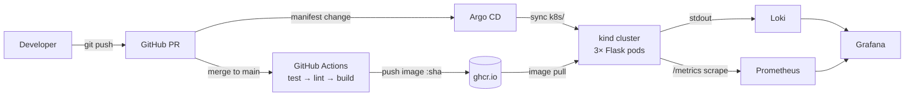

# Unit Converter — a GitOps learning platform

A deliberately small Flask app wrapped in a deliberately complete platform:
CI/CD, containers, Kubernetes, GitOps deployment, and observability —
built end-to-end as a hands-on study of modern platform engineering.

## Architecture

## Stack

| Layer | Tool | Role |
|---|---|---|
| App | Flask + gunicorn | HTTP API with /health and /metrics contracts |
| Quality | pytest, ruff | Behavior tests + static analyskvis, gated in CI |
| CI/CD | GitHub Actions | Test gate → image build → push to ghcr.io |
| Runtime | Docker / OCI | SHA-tagged immutable images |
| Orchestration | Kubernetes (kind) | 3 replicas, readiness probes, Service routing |
| Delivery | Argo CD | GitOps: cluster state reconciled to k8s/ on main |
| Observability | Loki, Prometheus, Grafana | Centralized logs, RED metrics, dashboards |

## Decisions & trade-offs

**Image tags: pinned commit SHAs, not latest.**
Alternative: let the deployment reference :latest and re-pull.
Why: the SHA makes every deploy a visible, reviewable diff in Git, and "what's running in prod?" becomes answerable by reading one line of one file. With latest, Kubernetes doesn't even notice the image changed — deploys silently don't happen.
Cost: every code change requires a second merge to move the pin — real toil I felt three times in one day, and the direct motivation for the CI-automation step in

**GitOps pull (ArgoCD) vs CI-push deploys**
Alternative:  CI-push deploys - GitHub actions running kubectl set image
Why:  CI-push deploys requires a kubeconfig stored in secrets. ArgoCD doesn't require any cluster credntials to be stored in source control.
Cost:  Bootstrap complexity, and a ~3-minute poll delay on deploys.

**Error contract: 400 for bad input, 500 reserved for real failures**
Alternative:  Let bad input explode into 500s.  
Why: Status codes are an API contract.  A 500 says "The server failed"; bad user input isn't a server failure , misreport it pollutes error metrics and blames the wrong party.  otably, I found this flaw through my own observability
stack: a garbage parameter produced a 500 and traceback visible in centralized
logs, which is what prompted the fix. The contract is now enforced by regression
tests in CI — missing, non-numeric, and empty inputs all assert a 400.
Cost:  code to check for  missing, nonnumeric, and empty input and display results gracefully to the user.   This is exactly why data validation libraries like pydantic exist;
this approach doesn't scale past a handful of parameters.

**Loki's label-indexed model over full text search (ELK/Datadog/Splunk)**
Alternative: full-text-indexed logging via ELK Stack or a commercial platform.
Why:  full-text-indexed logging — self-hosted ELK or a commercial platform.
Why: The core design difference is what gets indexed:. Loki indexes only a small set
of labels (namespace, pod) and brute-scans log content at query time; full-text
systems index every word at ingest. That makes Loki dramatically cheaper to run
and store — and as a single binary via Helm, operationally trivial for a local
cluster, at exactly zero cost. For Kubernetes-native, label-disciplined logs,
the model fits.
COST:  content is unsearchable except within label-selected streams — arbitrary
investigative search ("find this ID across all services, last 90 days") is
impractical, which is precisely what enterprises pay Splunk and Datadog for.
I also felt the model's sharp edge directly: labels are the entire query
surface, and schemas are configured, not automatic — my app's Kubernetes label
didn't survive into Loki's schema, forcing regex-on-pod-name queries until the
collection config is customized. At enterprise scale I'd expect a hybrid:
Loki for high-volume/low-value logs, commercial full-text for security and
audit trails.

**Cluster: kind (local) over managed Kubernetes (EKS/GKE/AKS).**
Alternative: a managed cloud cluster.
Why: kind runs a full cluster as a Docker container — created in under a minute,
destroyed and reproduced with two commands, free, and usable offline. For a
learning project that meant fast, consequence-free iteration. It also exposed
what managed clusters deliberately hide: the control plane itself runs as
visible pods (etcd, scheduler, controller-manager), so the machinery I was
learning was inspectable rather than abstracted away. And it kept the focus on
Kubernetes itself, not a cloud provider's implementation details.
Cost: nothing here resembles production operations. Single node — so no real
scheduling, node-failure, or network behavior. Storage is a directory on my
laptop; everything dies with the machine. Nothing is reachable by anyone but
me. And I got zero exposure to the managed-cluster concerns a platform team
actually lives with: IAM, load balancers, autoscaling, upgrades. The remedy is
the Terraform-plus-managed-cluster exercise in "What I'd do next."

## An incident, end to end

**Detection.** While testing, a garbage query parameter (`celsius=banana`)
returned a 500. In Grafana, a LogQL filter (`|= " 500 "`) across all replicas
surfaced the access-log line, with the Python traceback adjacent in the stream:
an unhandled `ValueError` from `float("banana")`.

**Diagnosis.** This was an API contract flaw, not a server failure: 500 claims
the server broke; invalid input should be a 400. Misclassifying it blamed the
wrong party and would corrupt error-rate metrics once dashboards landed.
Probing further turned up two sibling edges — missing and empty parameters —
that failed the same way.

**Fix.** Explicit validation returning 400s with descriptive JSON errors, plus
three regression tests asserting the contract in CI. Deployed through the
standard GitOps loop — code merge, CI-built image, SHA pin, Argo CD rollout —
with no manual cluster access.

**Verification.** The same banana now returns a 400 with a clean error body;
the 500 filter is silent; the error-rate dashboard classifies bad input as
4xx, distinct from server failures. A fuller remedy — declarative validation
via pydantic — is in "What I'd do next."

## Running it

Prerequisites: Docker Desktop, kind, kubectl, helm.

# 1. Cluster
kind create cluster --name learn

# 2. App (Argo CD will manage this from Git, but the first sync needs the CRDs first)
kubectl create namespace argocd
kubectl apply -n argocd --server-side -f https://raw.githubusercontent.com/argoproj/argo-cd/v3.4.5/manifests/install.yaml 2>&1 | tee argocd-install.log

# 2a. CHECKPOINT — verify the install completed before proceeding
kubectl get crds | grep argoproj
# → expect exactly 3: applications, applicationsets, appprojects

kubectl get pods -n argocd
# → expect 7 pods, all Running (image pulls take ~1–2 min on a fresh cluster;
#   watch with: kubectl get pods -n argocd -w)

# Do NOT proceed to step 3 until both checks pass. The install manifest is
# large and kubectl apply is not atomic — a single failed resource scrolls
# past easily. (This exact miss caused a partial install on 2026-07-17;
# see install log habit in step 2.)

# 3. Point Argo at this repo
kubectl apply -f argocd/application.yaml
# → Argo pulls k8s/ from main and deploys the app; no further kubectl needed

# 4. Observability
helm repo add grafana https://grafana.github.io/helm-charts
helm repo add prometheus-community https://prometheus-community.github.io/helm-charts
helm repo update
helm install loki grafana/loki-stack -n monitoring --create-namespace --set grafana.enabled=true --version 2.10.3
helm install prometheus prometheus-community/prometheus -n monitoring -f helm/prometheus-values.yaml --version 29.17.0
# Chart versions pinned to the versions verified working 2026-07-17; bump deliberately, not implicitly

# 5. Credentials

Both UIs use user 'admin'; extract the generated passwords:

#Argo CD
kubectl -n argocd get secret argocd-initial-admin-secret -o jsonpath="{.data.password}" | base64 -d

#Grafana
kubectl get secret -n monitoring loki-grafana -o jsonpath="{.data.admin-password}" | base64 -d

# 5a. CHECKPOINT — wait for Argo's first sync before port-forwarding the app
kubectl get pods -l app=unit-converter
# → expect Running. Argo's sync is async — the Application can show in the UI
#   before pods exist. If nothing is listed yet, watch with -w or check
#   sync status: kubectl get applications -n argocd

# 6. Access (each in its own terminal)
kubectl port-forward svc/argocd-server -n argocd 8080:443     # Argo UI  (admin / see secret below)
kubectl port-forward -n monitoring service/loki-grafana 3000:80   # Grafana
kubectl port-forward service/unit-converter 9000:80           # the app

# 7.  Manually add Prometheus datasource to Grafana

In grafana UI: Connections → Data sources → Add data source → Prometheus. Set URL to:

    http://prometheus-server.monitoring.svc.cluster.local

→ Save & Test should report success.  (This configuration lives only in Grafana's internal storage, not in Git — which is why it needs a runbook step. See "What is NOT in Git" below.)

# 8. Import the dashboard
In Grafana UI: Dashboards → New → Import → upload grafana/dashboards/unit-converter.json
(Dashboard is version-controlled; only the *import* is manual. Automating the
import via chart provisioning is a planned extension — see What is NOT in Git.)

## What is NOT in Git

Everything above the line survives `kind delete cluster` because Argo or Helm
reapplies it from this repo. These do not — they die with the cluster and are
recreated manually per the steps noted:

| Item                        | Recreated by | Path to zero                        |
|-----------------------------|--------------|-------------------------------------|
| Grafana Prometheus datasource | Step 7     | Chart values provisioning (planned) |
| Grafana dashboard           | Step 8       | Chart values provisioning (planned) |
| Argo CD admin password      | Step 5       | Acceptable — secrets shouldn't be in Git |
| install log (argocd-install.log) | Step 2  | Acceptable — ephemeral evidence     |

Discovered via teardown-rebuild drill, 2026-07-17: everything in Git came back
by itself; everything in this table did not. The goal is for the "planned"
rows to reach zero — at which point rebuild = run this file, no UI clicks.

## What I'd do next

**Manual image promotion.** Every code change needs a second PR to pin the new
SHA — toil I felt repeatedly. Remedy: a CI step that commits the SHA bump to
the manifest after a successful build (or Argo CD Image Updater). Would prove:
closing the loop from merge to production in one action.

**No real infrastructure.** Single-node kind cluster; nothing survives my
laptop. Remedy: Terraform-provisioned managed cluster (EKS/GKE). Would prove:
infrastructure-as-code and the managed-cluster operations the current setup
deliberately avoids.

**Port-forward access only.** Nothing has a stable address. Remedy: an ingress
controller. Would prove: production-style traffic entry and L7 routing.

**Config outside Git.** Grafana's datasource and dashboard exist only as manual
UI state. Remedy: Grafana provisioning (datasources/dashboards as files).

**One environment.** No staging. Remedy: Kustomize overlays with a second Argo
Application. Would prove: environment promotion within the GitOps model.

**Observability sees but never wakes anyone.** Remedy: re-enable Alertmanager,
alert on the error-rate query. Would prove: closing detection → notification.

**No supply-chain posture.** Images unscanned, dependencies unwatched. Remedy:
Trivy in CI + Dependabot. Would prove: a security gate alongside the quality
gates.

**Hand-rolled validation.** (Per the incident writeup.) Remedy: pydantic models.
Would prove: declarative contracts at the input layer.
